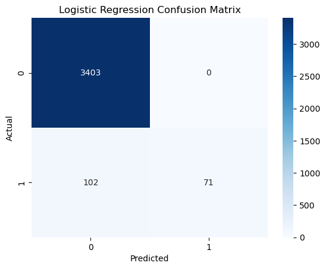

# Fake Job Post Detector – NLP-based Fraud Detection System

  

---

## Project Overview

The **Fake Job Post Detector** is an **NLP-based fraud detection system** designed to automatically identify fraudulent job postings.  
It helps **job seekers avoid scams** and **platforms maintain trustworthiness**.

**Objectives:**
- Detect fake job posts in a large dataset.
- Process and extract textual features using NLP.
- Train machine learning models for classification.
- Evaluate and optimize model performance.

---

## Dataset

- **Source:** Kaggle – Fake Job Postings Dataset  
- **Rows:** 17,880  
- **Columns:** 18  

**Sample Columns:**

| Column                | Description                                |
|-----------------------|--------------------------------------------|
| title                 | Job title                                  |
| location              | City, State, Country                        |
| department            | Job department                             |
| salary_range          | Offered salary range                        |
| company_profile       | Company description                          |
| description           | Job posting description                     |
| requirements          | Skills & requirements                       |
| benefits              | Employee benefits                            |
| telecommuting         | Binary: 0/1                                 |
| has_company_logo      | Binary: 0/1                                 |
| has_questions         | Binary: 0/1                                 |
| employment_type       | Full-time, Part-time, Contract, etc.       |
| required_experience   | Experience level                             |
| required_education    | Education level                              |
| industry              | Industry sector                              |
| function              | Job function                                 |
| fraudulent            | Target variable: 0 = Real, 1 = Fraudulent  |

---

## Data Cleaning & Preprocessing

- Fill missing values:
  - Text columns → empty strings
  - Binary columns → 0
- Combine textual columns: `title + description + requirements + company_profile`
- Preprocess text:
  - Lowercasing, punctuation removal
  - Stopword removal
  - Lemmatization

---

## Feature Extraction

- **TF-IDF vectorization:** `max_features=5000`, `ngram_range=(1,2)`  
- Add binary features (`telecommuting`, `has_company_logo`, `has_questions`)

---

## Train-Test Split

- 80/20 split, stratified on the `fraudulent` target.

---

## Machine Learning Models

### 1. Naive Bayes
- **Accuracy:** 0.96  
- **F1-score (fraudulent=1):** 0.49  

### 2. Logistic Regression
- **Accuracy:** 0.97  
- **F1-score (fraudulent=1):** 0.58  

**Observation:** Logistic Regression handles class imbalance and text patterns better than Naive Bayes.

---

## Model Evaluation

### Confusion Matrix – Logistic Regression

  

- False negatives remain challenging.  
- False positives are minimal, reducing unnecessary alerts.

---

## Predictions & Probabilities

Each job posting gets a **fraud probability score**.  

**Example top predictions:**

| Job ID | Title               | Actual | Predicted | Fraud Probability |
|--------|-------------------|--------|-----------|-----------------|
| 16996  | Marketing Intern    | 0      | 0         | 0.048           |
| 9358   | Scrum Master        | 0      | 0         | 0.004           |
| 11562  | HR Assistant        | 0      | 0         | 0.011           |

---

## Key Insights

- Logistic Regression outperforms Naive Bayes for text-based fraud detection.  
- Class imbalance is significant: only **866 fraudulent posts** out of 17,880.  
- Some fake posts closely resemble real postings, making detection challenging.  
- Misclassifications occur due to:
  - Feature independence assumption (Naive Bayes)  
  - Linear separation limitations (Logistic Regression)

---

## Tech Stack

- **Python** – data handling & modeling  
- **Pandas & NumPy** – data preprocessing  
- **NLTK** – text preprocessing (stopwords, lemmatization)  
- **Scikit-learn** – ML modeling & evaluation  
- **Seaborn & Matplotlib** – visualizations  

---

## Future Work

- Explore **deep learning models** (LSTM, Transformers) for improved text understanding.  
- Address **class imbalance** with oversampling/undersampling techniques.  
- Include **metadata features** (salary, location, department) to improve predictions.  
- Deploy a **real-time fraud detection system** for job posting platforms.
