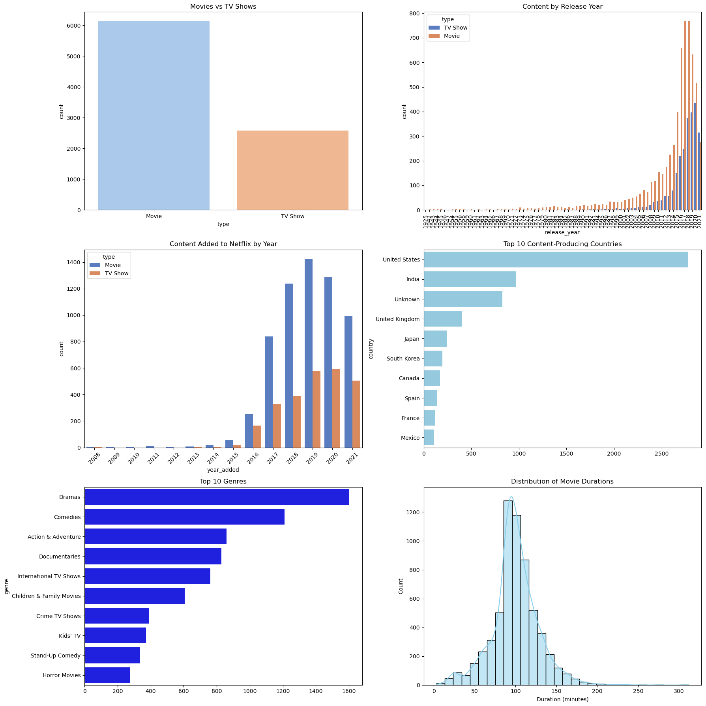
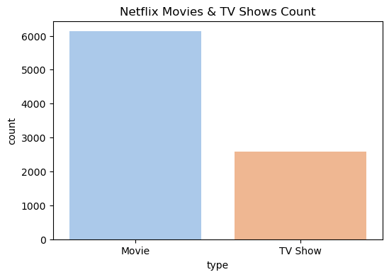
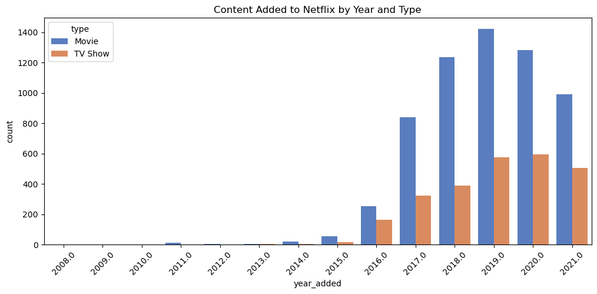
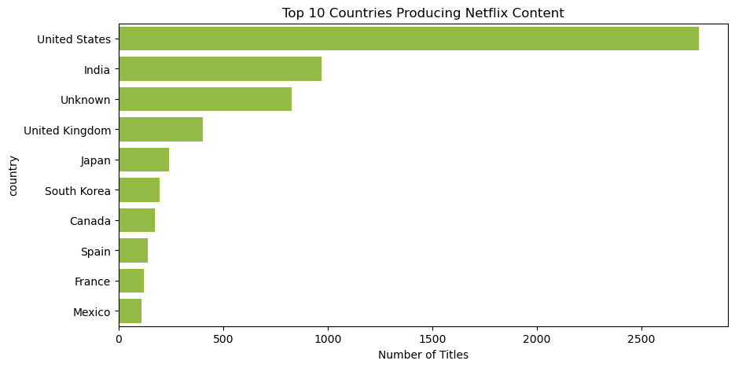
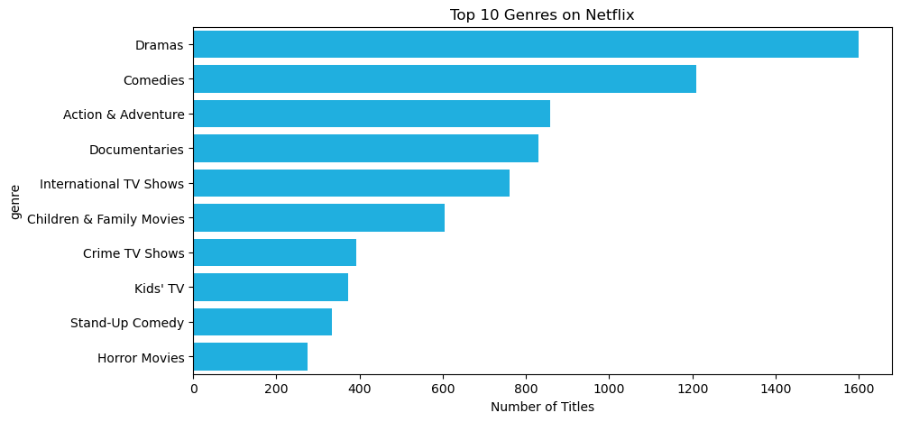
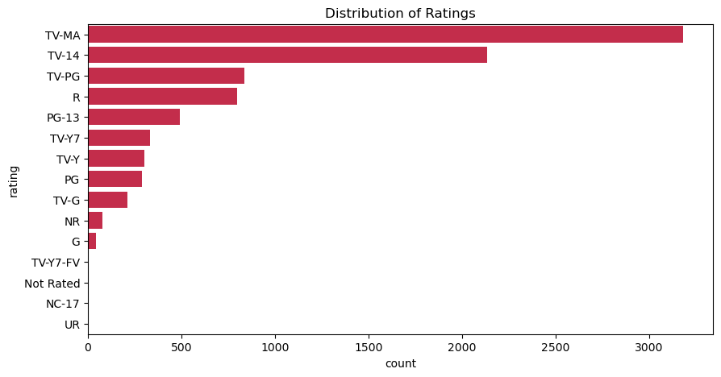
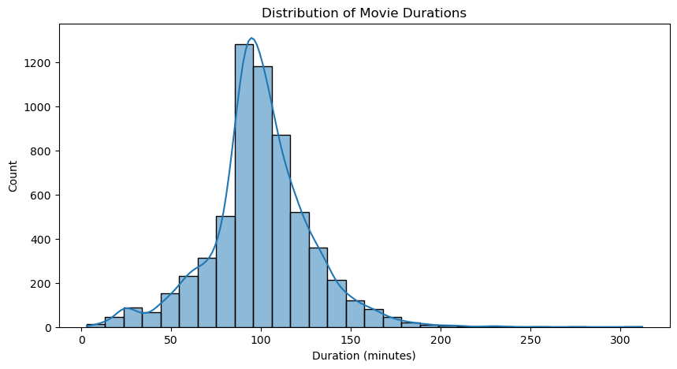

# Netflix Titles EDA

  

---

## Overview
This project performs **Exploratory Data Analysis (EDA)** on the Netflix Shows Dataset to uncover trends in content by **country, year, genre, and type** (Movies vs TV Shows).  

**Key Highlights:**

- Movies vs TV Shows distribution  
- Content growth over years and Netflix release year  
- Top countries producing Netflix content  
- Genre popularity analysis  
- Ratings and duration trends  
- KPI dashboard summarizing the dataset  

---

## Dataset
- **Source:** [Kaggle – Netflix Shows Dataset](https://www.kaggle.com/datasets/infamouscoder/dataset-netflix-shows)  
- **Rows:** 8,807 (Movies & TV Shows)  
- **Columns:** 12  

**Sample Columns:**

| Column | Description |
|--------|-------------|
| type | Movie / TV Show |
| title | Name of the content |
| country | Country of production |
| release_year | Original release year |
| rating | TV/Film rating |
| duration | Minutes (movies) / Seasons (TV shows) |
| listed_in | Genre categories |
| description | Content synopsis |

---

## Dataset KPIs

  

- **Total Titles:** 8,706  
- **Movies:** 6,131  
- **TV Shows:** 2,578  
- **Countries:** 746  
- **Unique Genres:** 36  

---

## Exploratory Data Analysis

### 1. Movies vs TV Shows

  

- Movies dominate the Netflix catalog (~70%)  
- TV shows growth is accelerating, especially in **2019–2020**  

---

### 2. Content Growth Over Time

**By Original Release Year**

  

**By Netflix Addition Year**

  

- Sharp increase in content added during **pandemic years**  

---

### 3. Top Content-Producing Countries

  

- **United States** and **India** lead content production  

---

### 4. Genre Analysis

  

- Most popular genres: **Dramas, Comedies, Documentaries, Action & Adventure**  

---

### 5. Ratings & Durations

**Rating Distribution**

  

**Movie Duration Distribution**

  

- Most content is **TV-MA or TV-14**  
- Movie durations peak around **90–110 minutes**  

---

## Key Insights
- Netflix catalog is **movie-heavy**, but TV shows are rapidly increasing  
- **United States** and **India** dominate production  
- **Dramas, Comedies, and Documentaries** are the most popular genres  
- Ratings and durations reflect targeted audience segments  
- **Pandemic years (2019–2021)** show significant content growth  

---

## Tech Stack
- **Python** – data analysis and visualization  
- **Pandas & NumPy** – data manipulation  
- **Matplotlib & Seaborn** – visualizations  
