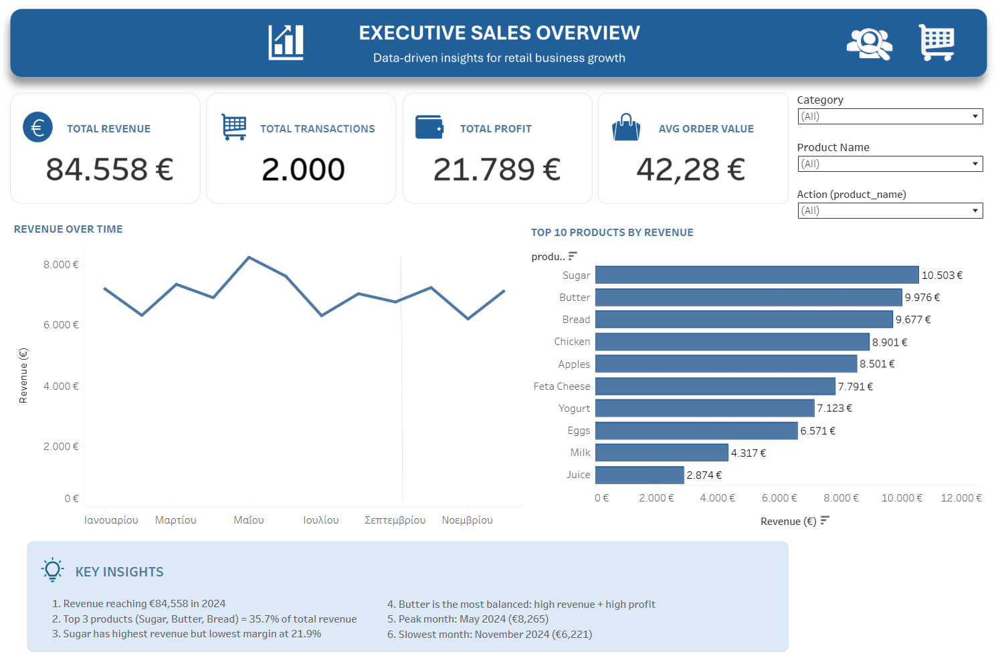
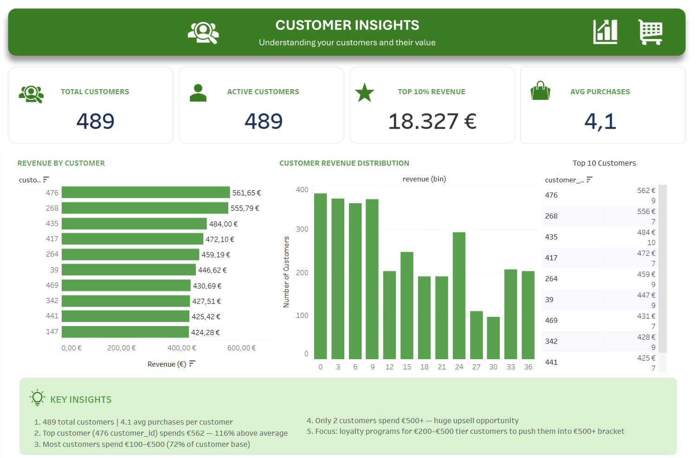
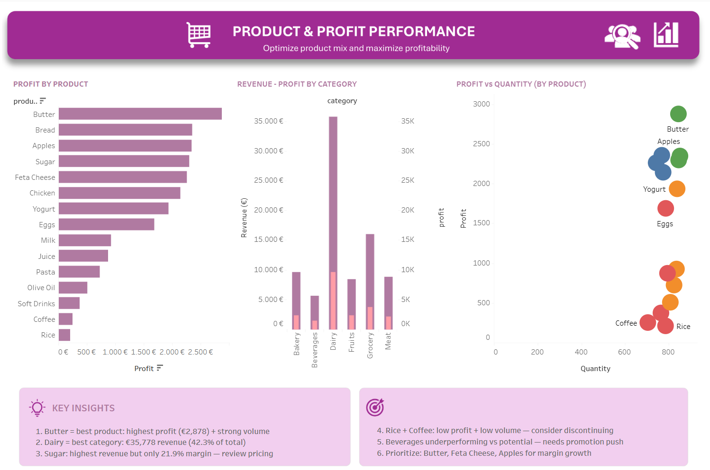

<h1 align="center"> Retail Sales Optimization - Data Analytics Case Study </h1>

<p align="center">
  
</p>

An Interactive Business Intelligence Solution built with Python (dataset creation) and Tableau Public. Focused on executive sales reporting, customer analytics, and product profitability optimization. 

[Tableau Visual](https://public.tableau.com/app/profile/kostanca.kovaci/viz/RetailSalesOptimization_17779954668030/Dashboard1-SalesOverview)

---

# Project Overview

This project presents a complete end-to-end Retail Sales Analytics solution developed using Tableau Public and Python generated dataset. The objective was to transform raw transactional retail data into a professional, executive-ready business intelligence system capable of supporting data-driven decision-making across:

- Sales Performance
- Customer Behaviour
- Product Profitability
- Revenue Optimization

The final solution includes 3 interactive and professional dashboards, with 11 analytical sheets, dashboard navigations from sales, customers and performance insights, KPI development and business insight recommendations.

---

# Executive Summary

A retail business lacked centralized visibility into sales performance, customer purchasing behaviour, and product profitability across 2,000 unique transactions and 15 product lines.

To address this challenge, I designed and developed a 3-dashboard analytics solution in Tableau Public featuring:

- Executive KPI Monitoring
- Revenue Trend Analysis
- Customer Segmentation
- Product Profitability Analysis
- Dynamic Filtering & Drill-Down Interactions

The analysis identified several high-impact business insights, including:

- Dairy generated 42.3% of total revenue
- The top 10% of customers contributed 21.7% of total revenue
- Sugar produced the highest revenue but one of the weakest profit margins
- Seasonal sales fluctuations created a €2,044 revenue gap between peak and low-performing months

The project concluded with actionable recommendations covering:

- Pricing Strategy
- Customer Retention
- Category Expansion
- Seasonal Promotions
- Product Optimization

---

# Business Problem

Retail managers often operate with fragmented reporting systems that make it difficult to monitor business performance in real time. In this scenario, the business lacked a centralized analytics system capable of answering critical operational questions such as:

- Which products generate the highest profit?
- Which customers contribute the most revenue?
- Which categories underperform?
- How does sales performance fluctuate seasonally?
- Where are pricing inefficiencies reducing profitability?

The goal of this project was to transform raw transactional data into a scalable and interactive business intelligence solution that enables faster, evidence-based decision-making.

---

# Objectives

The primary objectives of this project were:

- Generate Python dataset from scratch in a csv version
- Transform raw csv transactional data into analysis-ready datasets
- Develop professional executive dashboards with consistent design
- Create KPI monitoring systems for revenue, profit, and customer analysis
- Implement interactivity using filters, parameters, and dashboard navigation
- Generate actionable business insights and strategic recommendations
- Demonstrate real-world BI and analytics consulting workflow practices

---

# Dataset Overview

| Attribute | Details |
|---|---|
| Dataset Type | Retail Transactional Data |
| Source File | `sales_xls.csv` |
| Time Period | January 2024 – December 2024 |
| Transactions | 2,000 |
| Customers | 489 |
| Products | 15 |
| Categories | 6 |
| Dashboard Count | 3 |
| Analytical Sheets | 11 |

### Categories Included

- Dairy
- Grocery
- Bakery
- Meat
- Fruits
- Beverages

### Key Fields

- `transaction_id`
- `customer_id`
- `transaction_date`
- `product_name`
- `category`
- `quantity`
- `revenue`
- `profit`
- `cost_price`
- `selling_price`

---

# Analytics Workflow

## Step 1 — Data Acquisition

- Imported CSV transactional dataset into Tableau Public
- Validated field structure and schema consistency
- Reviewed data completeness and formatting

---

## Step 2 — Data Cleaning & Preparation

Performed several preprocessing steps to ensure analysis accuracy:

- Corrected incorrect data types
- Converted transaction dates into proper date format
- Standardized customer and transaction IDs
- Validated category consistency
- Checked for missing or invalid values

---

## Step 3 — Data Modeling & KPI Development

Built custom calculated fields to support advanced analytics and dashboard interactivity.

### Calculated Fields Created

| Field | Purpose |
|---|---|
| Profit Margin % | Product/category profitability |
| Avg Order Value | Revenue per transaction |
| Revenue per Customer | Customer value analysis |
| Avg Purchases per Customer | Purchase frequency |
| Active Customers | Customer activity tracking |
| Profit Tier | Scatter plot quadrant classification |
| Dynamic Date Filter | Time-based filtering |

---

## Step 4 — Exploratory Data Analysis

Conducted analysis to identify:

- Revenue trends over time
- Top-performing products
- Customer concentration patterns
- Product profitability distribution
- Category performance differences
- Seasonal sales fluctuations

---

## Step 5 — Dashboard Development

Designed and built 3 interactive dashboards:

### Dashboard 1 — Executive Sales Overview
Focused on:
- KPI monitoring
- Revenue trends
- Product performance

### Dashboard 2 — Customer Insights
Focused on:
- Customer segmentation
- Revenue concentration
- Customer purchasing behaviour

### Dashboard 3 — Product & Profitability
Focused on:
- Profit optimization
- Product analysis
- Category profitability

---

## Step 6 — Interactivity & User Experience

Implemented advanced dashboard interactions including:

- Filter Actions
- Dashboard Navigation
- Category Filtering
- Interactive Tooltips
- Cross-dashboard filtering

---

## Step 7 — Insight Generation & Recommendations

Translated analytical findings into business-focused recommendations related to:

- Pricing optimization
- Customer retention
- Product strategy
- Seasonal revenue improvement
- Category expansion opportunities

---

# Dashboard Walkthrough

# Dashboard 1 — Executive Sales Overview

## Purpose

Designed for stakeholders requiring a high-level overview of business performance.

## Key Features

- Revenue trend monitoring
- KPI scorecards
- Product performance analysis
- Interactive filtering
- Date range controls

## KPIs Included

- Total Revenue
- Total Profit
- Total Transactions
- Average Order Value

## Business Value

Enables executives to:
- Monitor sales performance quickly
- Identify revenue changes
- Track profitability trends
- Support strategic reporting

---

# Dashboard 2 — Customer Insights

## Purpose

Designed to analyze customer value, behaviour, and purchasing patterns.

## Key Features

- Customer revenue ranking
- Revenue distribution analysis
- Top customer tracking
- Customer transaction analysis

## Business Value

Supports:
- Customer segmentation
- Loyalty strategy development
- High-value customer identification
- Revenue concentration analysis

---

# Dashboard 3 — Product & Profitability

## Purpose

Designed to optimize product mix and category profitability.

## Key Features

- Product profit ranking
- Revenue vs Profit analysis
- Category comparison
- Profitability scatter plots

## Business Value

Helps stakeholders:
- Identify low-margin products
- Optimize pricing strategies
- Improve category performance
- Support inventory decisions

---

# Key Business Insights

## Revenue Performance

- Revenue peaked in May 2024 at €8,265
- Lowest-performing month was November 2024 at €6,221
- Seasonal revenue fluctuation reached 24.7%

### Top Revenue Products

| Product | Revenue |
|---|---|
| Sugar | €10,503 |
| Butter | €9,976 |
| Bread | €9,677 |

The top 3 products generated 35.7% of total revenue.

---

## Profitability Insights

Although Sugar generated the highest revenue, it also showed one of the weakest profit margins at 21.9%.

This indicates:
- strong sales volume
- weaker profitability efficiency

Butter emerged as the strongest balanced product:
- High revenue
- Highest total profit
- Strong margin performance

---

## Customer Behaviour Insights

### Key Findings

- 489 customers generated total annual sales
- Average purchases per customer: 4.1
- Top 10% of customers contributed 21.7% of revenue

### Strategic Observation

Most customers fall within the mid-spending segment (€100–€500), indicating strong upselling potential.

---

## Category Performance

### Dairy Category

| Metric | Value |
|---|---|
| Revenue | €35,778 |
| Revenue Share | 42.3% |
| Profit | €9,694 |

Dairy significantly outperformed all other categories in both revenue and profitability.

---

# Business Recommendations

## Pricing Optimization

Review Sugar pricing strategy due to weak margin performance despite high revenue contribution.

Potential improvement:
- 5% price increase
- Estimated €525 additional profit

---

## Customer Retention Strategy

Develop a loyalty program targeting top-performing customers to improve retention and increase lifetime value.

---

## Seasonal Revenue Strategy

Launch promotional campaigns during October–November to reduce seasonal sales decline.

---

## Category Expansion

Expand Dairy product offerings and promotional investment due to strong profitability performance.

---

## Product Portfolio Optimization

Evaluate underperforming products such as Rice and Coffee for:
- supplier renegotiation
- pricing adjustments
- potential discontinuation

---

# Technical Skills Demonstrated

## Business Intelligence & Analytics

- Python (Pandas, NumPy)
- Tableau Public
- Dashboard Design
- Interactive Data Visualization
- KPI Development
- Executive Reporting

## Data Analysis

- Calculated Fields
- Customer Segmentation
- Profitability Analysis
- Revenue Trend Analysis

## Business Strategy

- Insight Generation
- Decision Support Analytics
- Pricing Optimization
- Business Storytelling

---

# Tools & Technologies

| Tool | Purpose |
|---|---|
| Python | Customer Table Generation |
| Tableau Public | Dashboard Development |
| CSV Dataset | Data Source |
| Calculated Fields | KPI Logic |
| Parameters | Dynamic Filtering |
| Filter Actions | Dashboard Interactivity |

---

# Repository Structure

```bash
Retail Sales Optimization/
│
├── README.md
├── data/
│   └── sales_xls.csv
│
├── dashboards/
│   ├── dashboard_1.png
│   ├── dashboard_2.png
│   └── dashboard_3.png
│
├── documentation/
│   ├── case_study.pdf
│   ├── methodology.pdf
│   └── insights_summary.pdf
│
├── tableau/
│   └── Retail Sales Optimization.twbx
│
└── assets/
    └── retail_sales_optimization.png
```

---

# Project Reflection

This project reinforced the importance of combining technical analytics skills with business storytelling. Beyond building dashboards, the primary focus was translating transactional data into actionable business insights that support strategic decision-making.

The project demonstrates:
- analytical thinking
- BI dashboard development
- executive communication
- data storytelling
- consulting-oriented problem solving

---

# Screenshots

## Executive Sales Dashboard


---

## Customer Insights Dashboard


---

## Product & Profitability Dashboard


---

# Contact

## LinkedIn
[LinkedIn](https://www.linkedin.com/in/kostanca-kovaci/)

## Portfolio Website
[Portfolio](https://kovacikostanca.github.io/)

## Tableau Public
[Tableau Public](https://public.tableau.com/app/profile/kostanca.kovaci/vizzes)

## Email
kovacikostanca@gmail.com
---

# Author

**Kostanca Kovaci**  
Data Analytics & Business Intelligence Consultant

Specializing in:
- Tableau
- Data Visualization
- Business Intelligence
- Dashboard Development
- Analytics Consulting

---
