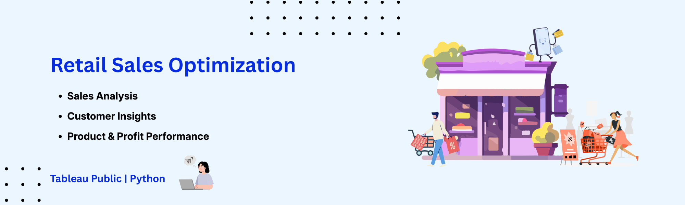

# Retail Sales Optimization - Data Analytics Case Study

An Interactive Business Intelligence Solution built with Python (dataset creation) and Tableau Public.

Focused on executive sales reporting, customer analytics, and product profitability optimization.

  

